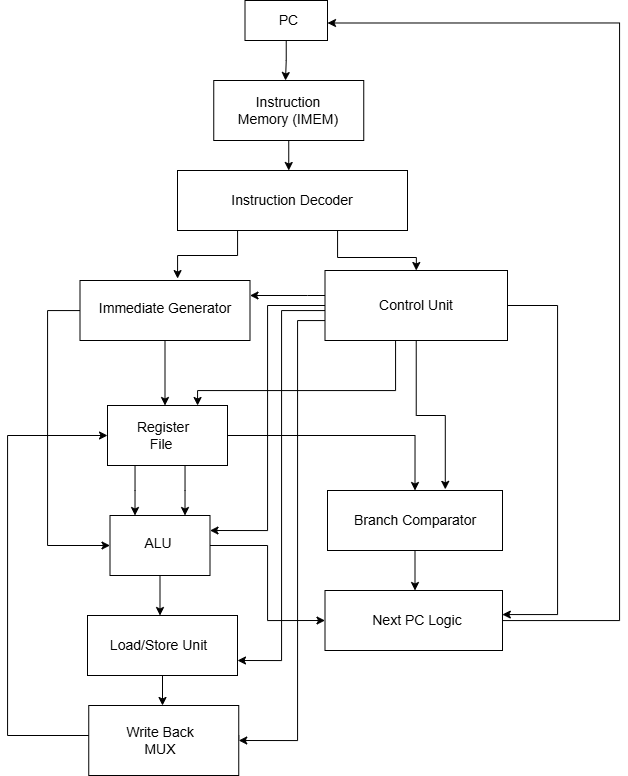
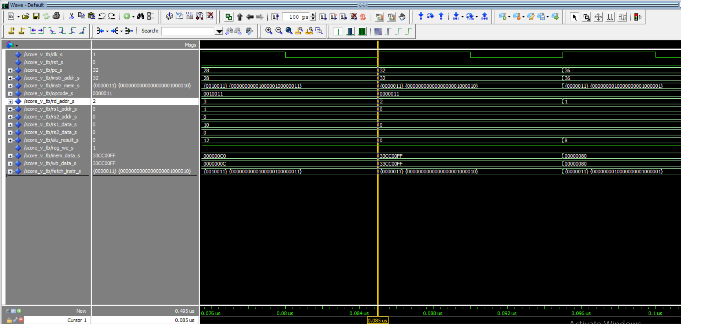

# SCore-V

## Project Overview
SCore-V is a simplified educational processor implementation based on the RV32I subset of the RISC-V instruction set architecture. The goal of the project is to demonstrate the core concepts of processor design, including instruction fetching, decoding, execution, memory access, and write-back operations within a modular hardware architecture.

The processor is implemented in VHDL and organized as a set of interconnected components that together form a complete datapath and control structure. The design illustrates how instructions flow through the processor and how different functional units cooperate to execute them.

The main objective of the project is to provide a clear and structured hardware design that can be simulated, tested, and synthesized, while also serving as a learning platform for understanding processor architecture and digital system design.

## Processor Functionality
The processor supports a set of fundamental instruction types derived from the RV32I architecture. These instructions allow the processor to perform arithmetic and logical operations, memory accesses, control flow changes, and register manipulation.

The supported functionality includes:
- Arithmetic and logical operations performed by the ALU
- Immediate-based operations using generated immediate values
- Load instructions for reading data from memory
- Store instructions for writing data to memory
- Branch instructions for conditional control flow
- Jump instructions for program control transfer
- Upper immediate instructions for register initialization and address generation

These operations enable the processor to execute basic programs and demonstrate the complete instruction execution flow.

## Processor Architecture
The processor is composed of several main functional units that cooperate to execute instructions. These units are connected through the processor datapath and coordinated by the control logic.

Key architectural components includes:
- Program Counter (PC) – keeps track of the address of the current instruction.
- Instruction Fetch Unit – retrieves instructions from instruction memory.
- Instruction Decoder – interprets instruction fields and determines the required operations.
- Control Unit – generates control signals that coordinate datapath components.
- Register File – stores general-purpose registers used during instruction execution.
- Immediate Generator – extracts and formats immediate values from instructions.
- Arithmetic Logic Unit (ALU) – performs arithmetic and logical operations.
- Branch Comparator – evaluates branch conditions.
- Load/Store Unit (LSU) – handles memory read and write operations.
- Write-Back Multiplexer – selects the data written back to the register file.

Together, these components form the core datapath that enables instruction execution.

The following diagram illustrates the high-level architecture of the SCore-V processor and the main datapath components.

The Program Counter (PC) determines the address of the next instruction, which is fetched from instruction memory. 
The instruction is then decoded and control signals are generated by the control unit.

Operands are read from the register file and processed by the ALU. 
For memory-related instructions, the Load/Store Unit accesses data memory. 
Finally, the result is written back to the register file through the write-back stage.

## Main Components

Each component has a specific responsibility within the datapath.

**Program Counter (PC)**  
Stores the address of the current instruction and updates it with the address of the next instruction to be executed.

**Instruction Memory (IMEM)**  
Provides the instruction located at the address specified by the program counter.

**Instruction Decoder**  
Extracts instruction fields such as opcode, register addresses, function bits, and immediate values.

**Control Unit**  
Generates control signals that determine how the datapath components behave for each instruction.

**Immediate Generator**  
Produces sign-extended immediate values used by immediate, branch, load, and store instructions.

**Register File**  
Stores general-purpose registers and provides operands used during instruction execution.

**Arithmetic Logic Unit (ALU)**  
Performs arithmetic and logical operations and calculates addresses for memory operations.

**Branch Comparator**  
Evaluates branch conditions and determines whether a branch should be taken.

**Load/Store Unit**  
Handles memory read and write operations for load and store instructions.

**Write-Back Multiplexer**  
Selects which result (ALU output, memory data, etc.) is written back to the register file.

**Next PC Logic**  
Determines the next value of the program counter based on sequential execution, branches, or jumps.

## Instruction Execution Example

Example instruction:

> `lw x2, 0(x0)`

This instruction loads a 32-bit word from memory at the address stored in register x0 and writes the result into register x2.

**IF – Instruction Fetch**
In the instruction fetch stage, the Program Counter (PC) provides the address of the current instruction.
This address is sent to the Instruction Memory (IMEM), which returns the instruction stored at that location.
The PC is then updated to point to the next instruction.

**ID – Instruction Decode**
In the decode stage, the Instruction Decoder extracts fields from the instruction, including the opcode, source registers, destination register, and immediate value.
The Register File reads the value stored in register x0.
At the same time, the Immediate Generator produces the immediate value from the instruction.
The Control Unit generates control signals that determine how the datapath components will operate during execution.

**EX – Execute**
During the execute stage, the ALU calculates the effective memory address.
For the lw instruction, the ALU adds the value from register x0 and the immediate offset to produce the memory address where the data is located.

**MEM – Memory Access**
In this stage, the Load/Store Unit (DMEM) reads the data from memory using the address produced by the ALU.
The requested word is retrieved from data memory.

**WB – Write Back**
In the final stage, the Write-Back Multiplexer selects the data read from memory and writes it back into the destination register x2 in the Register File.

## Waveform-Based Execution Example

The following waveform shows signal activity during instruction execution in the processor.
It is used to illustrate how a load-type instruction propagates through the datapath.

> `lw x2, 0(x0)`

*Figure: ModelSim waveform showing execution of the `lw x2, 0(x0)` instruction.*

This example is used to illustrate how a load instruction propagates through the datapath.
It does not necessarily correspond to the current integration test program.
For example instruction at program counter value PC = 32 and has the following binary encoding:
00000000000000000010000100000011

The waveform was captured during simulation using the score_v_tb testbench in ModelSim.

It shows how this instruction progresses through the five classical execution stages: Instruction Fetch (IF), Instruction Decode (ID), Execute (EX), Memory Access (MEM), and Write Back (WB).

**Instruction Fetch (IF)**
In the fetch stage, the program counter signal pc_s holds the value 32, which corresponds to the address of the instruction in instruction memory.
At this address, the instruction is fetched from instruction memory and becomes visible on the signal fetch_instr_s.

**Instruction Decode (ID)**
During the decode stage the instruction fields are interpreted.
The signal opcode_s has the value 0000011, which corresponds to a load instruction in the RISC-V ISA.
At the same time, the destination register appears on rd_addr_s, which has the value 00010, corresponding to register x2.
The base register is x0, whose value is read from the register file through rs1_data_s.

**Execute (EX)**
In the execute stage the Arithmetic Logic Unit computes the effective memory address.
For the instruction lw x2, 0(x0), the ALU adds the value of register x0 (which is zero) and the immediate offset 0.
The resulting address appears on the signal alu_result_s.

**Memory Access (MEM)**
In the memory stage the Load/Store Unit reads data from the data memory at the address produced by the ALU.
The loaded value becomes visible on the signal mem_data_s.

**Write Back (WB)**
Finally, the loaded value is written back to the destination register.
The signal wb_data_s carries the value that will be written into register x2, while the signal reg_we_s indicates that the register write operation is enabled.
This waveform demonstrates how the lw x2, 0(x0) instruction propagates through the processor datapath and how the relevant control and data signals change across clock cycles as the instruction progresses through the IF, ID, EX, MEM, and WB stages.

## Reproducing Simulation Results

The SCore-V processor project uses VUnit to automate compilation and simulation of the VHDL design.
The SCore-V project uses a Linux-based workflow for compiling and executing simulations.
The following steps describe how to run the test suite and observe signal waveforms.

**Required Tools**

To reproduce the simulation results, the following tools are required:
-	Python 3
-	VUnit Python package
-	GTKWave

**Running the Full Test Suite**

Navigate to the scripts directory:

> `cd SCore-V/scripts`

Before running the scripts, normalize line endings:

> `sed -i 's/\r$//' compile.sh`

Then compile the project:

> `bash compile.sh`

To execute all available testbenches:

> `python3 run.py`

If the simulation is successful, the console output will indicate that all tests have passed.

**Running a Specific Testbench**

To run only the processor-level testbench:

> `python3 run.py testbench_lib.score_v_tb.test_score_v`

**Running Simulation with Waveform Visualization**

To run the simulation with waveform visualization:

>`python3 run.py testbench_lib.score_v_tb.test_score_v --gui`

This will open GTKWave, allowing inspection of internal processor signals and instruction execution behavior.

The SCore-V project relies on a simple but well-structured toolchain used for program generation, simulation, and verification.  
More details about these tools can be found at the following links:

- [Assembler](https://github.com/etf-unibl/SCore-V/wiki/Assembler)  
- [Conformance Tests](https://github.com/etf-unibl/SCore-V/wiki/Conformance-tests)  
- [VUnit Guide](https://github.com/etf-unibl/SCore-V/wiki/VUnit-uputstvo)
