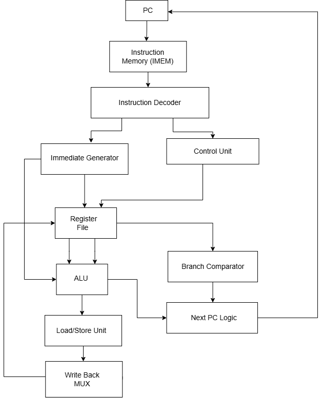

# SCore-V

## Project Overview
SCore-V is a simplified educational processor implementation based on the RV32I subset of the RISC-V instruction set architecture. The goal of the project is to demonstrate the core concepts of processor design, including instruction fetching, decoding, execution, memory access, and write-back operations within a modular hardware architecture.

The processor is implemented in VHDL and organized as a set of interconnected components that together form a complete datapath and control structure. The design illustrates how instructions flow through the processor and how different functional units cooperate to execute them.

The main objective of the project is to provide a clear and structured hardware design that can be simulated, tested, and synthesized, while also serving as a learning platform for understanding processor architecture and digital system design.

## Processor Functionality
The processor supports a set of fundamental instruction types derived from the RV32I architecture. These instructions allow the processor to perform arithmetic and logical operations, memory accesses, control flow changes, and register manipulation.

The supported functionality include:
- Arithmetic and logical operations performed by the ALU
- Immediate-based operations using generated immediate values
- Load instructions for reading data from memory
- Store instructions for writing data to memory
- Branch instructions for conditional control flow
- Jump instructions for program control transfer
- Upper immediate instructions for register initialization and address generation

These operations enable the processor to execute basic programs and demonstrate the complete instruction execution flow.

## Processor Architecture
The processor is composed of several main functional units that cooperate to execute instructions. These units are connected through the processor datapath and coordinated by the control logic.

Key architectural components includes:
- Program Counter (PC) – keeps track of the address of the current instruction.
- Instruction Fetch Unit – retrieves instructions from instruction memory.
- Instruction Decoder – interprets instruction fields and determines the required operations.
- Control Unit – generates control signals that coordinate datapath components.
- Register File – stores general-purpose registers used during instruction execution.
- Immediate Generator – extracts and formats immediate values from instructions.
- Arithmetic Logic Unit (ALU) – performs arithmetic and logical operations.
- Branch Comparator – evaluates branch conditions.
- Load/Store Unit (LSU) – handles memory read and write operations.
- Write-Back Multiplexer – selects the data written back to the register file.

Together, these components form the core datapath that enables instruction execution.

The following diagram illustrates the high-level architecture of the SCore-V processor and the main datapath components.

The Program Counter (PC) determines the address of the next instruction, which is fetched from instruction memory. 
The instruction is then decoded and control signals are generated by the control unit.

Operands are read from the register file and processed by the ALU. 
For memory-related instructions, the Load/Store Unit accesses data memory. 
Finally, the result is written back to the register file through the write-back stage.

## Main Components

Each component has a specific responsibility within the datapath.

**Program Counter (PC)**  
Stores the address of the current instruction and updates it with the address of the next instruction to be executed.

**Instruction Memory (IMEM)**  
Provides the instruction located at the address specified by the program counter.

**Instruction Decoder**  
Extracts instruction fields such as opcode, register addresses, function bits, and immediate values.

**Control Unit**  
Generates control signals that determine how the datapath components behave for each instruction.

**Immediate Generator**  
Produces sign-extended immediate values used by immediate, branch, load, and store instructions.

**Register File**  
Stores general-purpose registers and provides operands used during instruction execution.

**Arithmetic Logic Unit (ALU)**  
Performs arithmetic and logical operations and calculates addresses for memory operations.

**Branch Comparator**  
Evaluates branch conditions and determines whether a branch should be taken.

**Load/Store Unit**  
Handles memory read and write operations for load and store instructions.

**Write-Back Multiplexer**  
Selects which result (ALU output, memory data, etc.) is written back to the register file.

**Next PC Logic**  
Determines the next value of the program counter based on sequential execution, branches, or jumps.